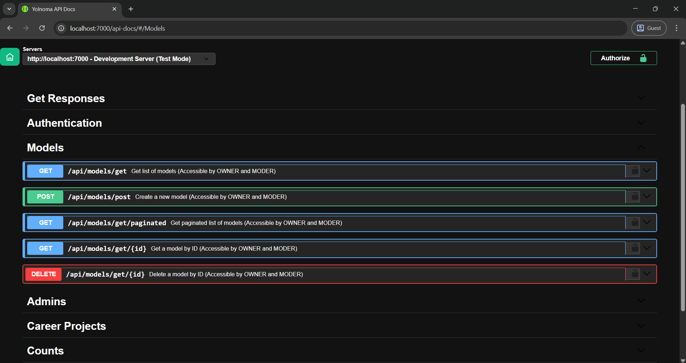
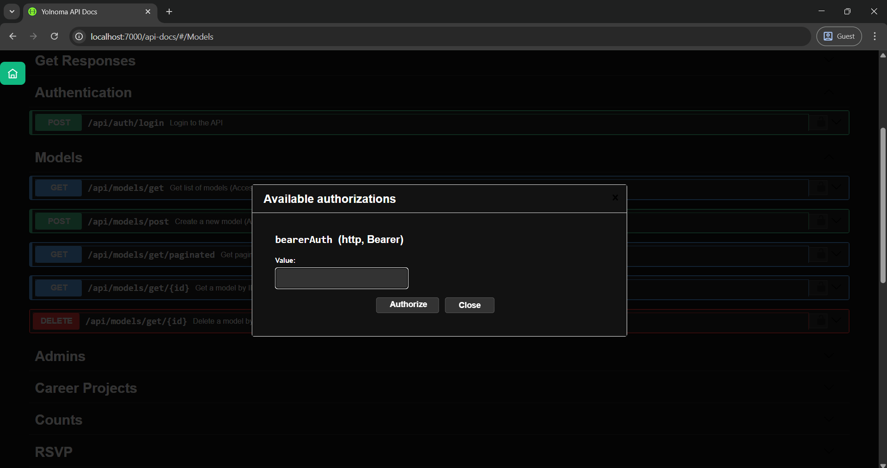
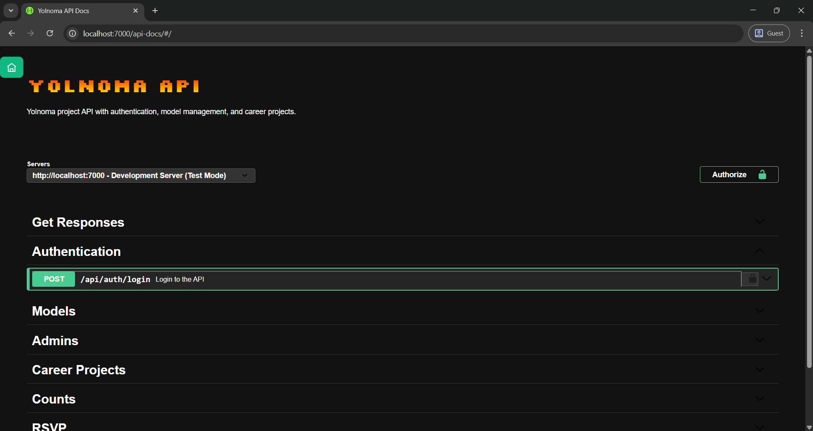

## Swagger Custom Style and Dynamic js components

npm install `swagger-custom`

### Images

 

| Image | Image |
|----|----------|
| ||

## Installation 

| Package Manager | Command |
|----------------|---------|
| **npm**        | `npm install swagger-custom` |
|                |                              |
| **yarn**       | `yarn add swagger-custom`    |
|                |                              |
| **bun**        | `bun install swagger-custom` |


### Use `swagger-custom`

```js
const express = require('express');
const swaggerUi = require('swagger-ui-express');
const swaggerCustom = require('swagger-custom');
// Swagger document
const swaggerDocument = require('./swagger/swagger.json');

const app = express();

// Init swagger-custom
const custom = swaggerCustom();

// Serve swagger-custom assets
app.use('/swagger-custom', custom.router);

// Swagger UI
app.use(
  '/api-docs',
  swaggerUi.serve,
  swaggerUi.setup(swaggerDocument, {
    customCssUrl: custom.options.customCssUrl,
    customJs: custom.options.customJs,
    customSiteTitle: 'My Custom API Docs',
  })
);

// Run server
app.listen(3000, () => {
  console.log('API Docs → http://localhost:3000/api-docs');
});
```

```js
-----------------------------------------------
 * Swagger Custom Package
 * Author: Jasur Haydarov (jas-kha)
 * Description: Custom CSS & JS injector for 
 * Swagger UI with optimized minified output.
 * Build: Auto-generated using Rollup.
 * GitHub: https://github.com/jas-kha/swagger-custom
 * Copyright(c) 2025 JH.
 * Copyright(c) 2025-2026 Jasurbek Haydarov Baxtiyorovich
 * MIT Licensed
-----------------------------------------------
```